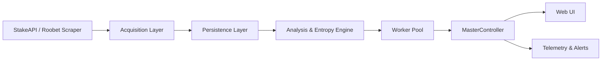

## Architecture Overview

This document is the canonical reference for the overall architecture of the Neural-Entropy Statistical Integrity Suite. It consolidates information that was previously scattered across `README.md`, `.github/IMPLEMENTATION_PLAN.md`, and `COMPREHENSIVE_ANALYSIS.md`.

### High-Level System Diagram

### Repository Layout

The codebase is organized by domain, not by technology:

- **`src/acquisition/`**: Data ingestion for Stake/Roobet.
  - `stakeApi.ts`: Stake GraphQL client (balances, seeds, bet history).
  - `StakeLiveRunner.ts`: Live authenticated runner for Stake.
  - `liveStream.ts`: WebSocket ingestor with reconnect/backoff and batching.
  - `hashCracker.ts`: Hashes.com + Nitrxgen integration for preimage lookup.
  - `ContractVerifier.ts`: Ethereum smart-contract root hash verification.
- **`src/analysis/`**: Statistical engines and integrity checks.
  - `IntegrityAuditor.ts`: Hash-space explorer and integrity checks.
  - `ClusterVarianceAnalyzer.ts`: Monte Carlo density mapping and deviation maps.
  - `SeedInfluenceAnalyzer.ts`: Chi-square uniformity and entropy metrics.
  - `AllocationEngine.ts`: Kelly-style bankroll allocation.
  - `VolatilityHedge.ts`: Gaussian variance circuit breaker.
- **`src/automation/`**:
  - `Orchestrator.ts`: High-level pipeline orchestration over acquisition + analysis.
- **`src/components/`**: React UI components.
  - `MinesGame.tsx`, `KenoGame.tsx`, `CrashGame.tsx`: Game UIs and verification views.
  - `MinesGrid.tsx`, `FutureChainSidebar.tsx`, `GoldPathHUD.tsx`: Probability overlays, nonce timelines, and tactical HUD.
  - `BatchVerification.tsx`, `ConfigPanel.tsx`, `ServerSeedReveal.tsx`: Configuration, batch verification, and seed-reveal UX.
- **`src/controllers/`**:
  - `MasterController.ts`: Orchestrates deterministic and probabilistic modes, worker scans, and analysis flows.
- **`src/data/`**:
  - `SeedHarvester.ts`: Historical bet record ingestion and transformation.
- **`src/db/`**:
  - `db.ts`: SQLite and browser DB adapters, storing verified seeds and root hashes.
- **`src/hooks/`**:
  - React hooks (e.g. `use-mobile`) for shared UI behaviour.
- **`src/lib/`**:
  - `crypto.ts`: Cryptographic helpers (HMAC/SHA-256, SHA-256 commitments).
  - `types.ts`: Shared type definitions.
  - `utils.ts`: General-purpose utilities.
- **`src/server/api/` & `src/server/express.ts`**:
  - Dev-only API endpoints and Express bridge for local/CI orchestration.
- **`src/simulation/`**:
  - `PnLSimulator.ts`: Walk-forward PnL simulation and backtesting.
- **`src/styles/`**:
  - Theme and Tailwind/shadcn styles.
- **`src/telemetry/`**:
  - `TelemetryDispatcher.ts`: Discord/SMTP/webhook telemetry dispatch.
- **`src/utils/`**:
  - `fairnessEngine.ts`: HMAC-SHA256 provably-fair verification logic for Mines, Keno, Crash.
  - `opsec.ts`: Traffic mimicry and anti-fingerprinting helpers.
- **`src/workers/`**:
  - `workerPool.ts`: Ultra-high frequency worker pool orchestrator.
  - `aimingWorker.ts`: Multi-game state reconstruction brain.
  - `GameAlgorithms.ts`: Platform-specific game configuration and mapping logic.

Outside `src/`:

- **`scripts/`**:
  - `generateBaseline.ts`: Baseline dataset generation (10k+ rounds).
  - `entropy_auditor.py`: Python chi-square auditor.
  - `stake_audit.py`: Stake audit script for GraphQL bet history.
  - `liveScraper.ts`: Roobet DOM scraper (Playwright).
  - `distributedScan.ts`: Distributed brute-force scanning.
  - `verifySmartContract.ts`: Ethereum contract verification.
- **`worker/cors-proxy-worker.js`**:
  - Cloudflare Worker acting as a CORS/API proxy with browser-mimicking headers.

### Logical Architecture

1. **Acquisition Layer**
   - Pulls historical records (HTTP + GraphQL).
   - Subscribes to live streams (WebSockets, DOM scraping).
   - Resolves hashes to seeds using local DB + external services.
2. **Persistence Layer**
   - SQLite (Node) and browser storage for verified seeds, entropy metrics, and audit history.
   - Used as the single source of truth for all downstream analysis and UI views.
3. **Analysis & Entropy Engine**
   - Runs Monte Carlo simulations, cluster variance analysis, seed influence analysis, and allocation/hedge strategies.
   - Produces risk, bias, and integrity metrics for each game/platform configuration.
4. **Worker Pool & Game Algorithms**
   - Offloads CPU-intensive game mapping and search to Web Workers.
   - Supports deterministic (preimage known) and probabilistic (heatmap) modes.
5. **Controllers**
   - `MasterController` coordinates acquisition, workers, and analysis.
   - Provides APIs to the UI and to automation scripts.
6. **User Interface**
   - Real-time views for Mines, Keno, Crash.
   - HUD overlays (Gold Path, future nonce chains).
   - Configuration panels and batch verification tooling.
7. **Telemetry & Automation**
   - Telemetry dispatcher for alerts.
   - GitHub Actions workflows for scheduled audits and CI.

For current implementation progress by module and phase, see `docs/status.md`.

